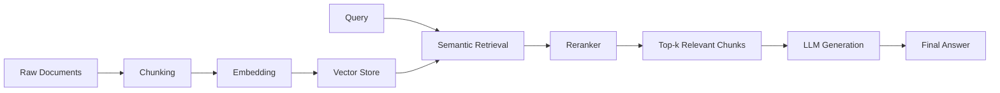

# First RAG Notebook

A learning project built on the principle that real skill comes from struggling with hard things, not from watching or copying. This is my first hands-on RAG (Retrieval-Augmented Generation) project on the path to becoming an ML/AI Engineer — built by breaking a problem I didn't fully know how to solve into small steps, getting it wrong, and iterating until it worked.

## Philosophy

> You don't learn by doing the easy thing or watching someone else do the hard thing. You learn by attempting something that requires a skill you don't have yet, struggling with it, breaking it down, and getting it wrong before you get it right.

This notebook is a direct application of that: a simple RAG pipeline built from scratch to understand *why* each component exists, not just how to call it.

## What's Inside

A simple, complete RAG pipeline covering:

- **Chunking** — splitting source documents into retrievable pieces
- **Semantic Retrieval** — embedding-based similarity search to find relevant chunks
- **Reranking** — re-scoring retrieved chunks for better relevance before passing them to the LLM

## Pipeline Overview

## Components

| Stage | Purpose |
|-------|---------|
| **Chunking** | Breaks documents into manageable, semantically coherent pieces |
| **Embedding + Semantic Retrieval** | Converts chunks/query into vectors and retrieves the most similar chunks |
| **Reranker** | Reorders retrieved chunks by relevance to improve the quality of context sent to the LLM |
| **Generation** | LLM produces the final answer using the reranked, retrieved context |

## Status

🚧 First iteration — focused on understanding the core mechanics of RAG (chunking → retrieval → reranking → generation) before moving to more advanced techniques (hybrid search, query rewriting, evaluation metrics, etc.)

## Next Steps

- Experiment with different chunking strategies (fixed-size vs. semantic chunking)
- Compare reranker models and their impact on answer quality
- Add basic evaluation (retrieval precision/recall, answer relevance)
- Move toward a production-style RAG architecture
